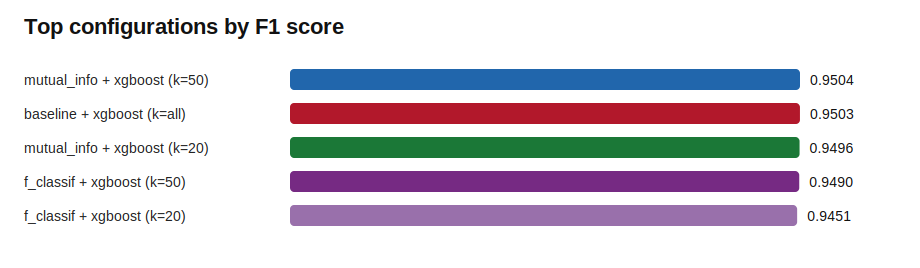
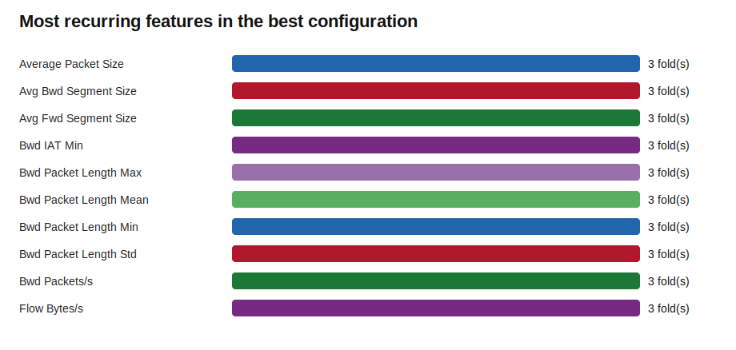

# Feature Selection Benchmark Report: Android_Ransomeware.csv

Highest F1: **mutual_info + xgboost (k=50)** with F1=0.9504. 

## Dataset And Run

- Rows evaluated: **50,000**
- Usable numeric features: **68**
- Benign samples: **5,496**
- Ransomware samples: **44,504**
- Cross-validation folds: **3**
- Selectors: **baseline, mutual_info, f_classif**
- Classifiers: **xgboost**
- k values tested: **20, 50**

## Leaderboard

| Configuration | F1 | Recall | Precision | PR-AUC | Features | Fit seconds |
| --- | --- | --- | --- | --- | --- | --- |
| mutual_info + xgboost (k=50) | 0.9504 | 99.66% | 90.84% | 0.9666 | 50.0 | 15.42 |
| baseline + xgboost (k=all) | 0.9503 | 99.66% | 90.82% | 0.9665 | 68.0 | 7.69 |
| mutual_info + xgboost (k=20) | 0.9496 | 99.64% | 90.71% | 0.9657 | 20.0 | 29.18 |
| f_classif + xgboost (k=50) | 0.9490 | 99.63% | 90.60% | 0.9642 | 50.0 | 8.11 |
| f_classif + xgboost (k=20) | 0.9451 | 99.64% | 89.89% | 0.9548 | 20.0 | 5.43 |

## Best Vs. No Feature Selection

- Best configuration: **mutual_info + xgboost (k=50)**
- Best baseline: **baseline + xgboost (k=all)**
- F1 change vs baseline: **+0.0001**
- Feature reduction vs baseline: **26.5%**

## Most Stable Features In The Best Configuration

| Feature | Selected in |
| --- | --- |
| Average Packet Size | 3/3 folds |
| Avg Bwd Segment Size | 3/3 folds |
| Avg Fwd Segment Size | 3/3 folds |
| Bwd IAT Min | 3/3 folds |
| Bwd Packet Length Max | 3/3 folds |
| Bwd Packet Length Mean | 3/3 folds |
| Bwd Packet Length Min | 3/3 folds |
| Bwd Packet Length Std | 3/3 folds |
| Bwd Packets/s | 3/3 folds |
| Flow Bytes/s | 3/3 folds |
| Flow Duration | 3/3 folds |
| Flow IAT Max | 3/3 folds |
