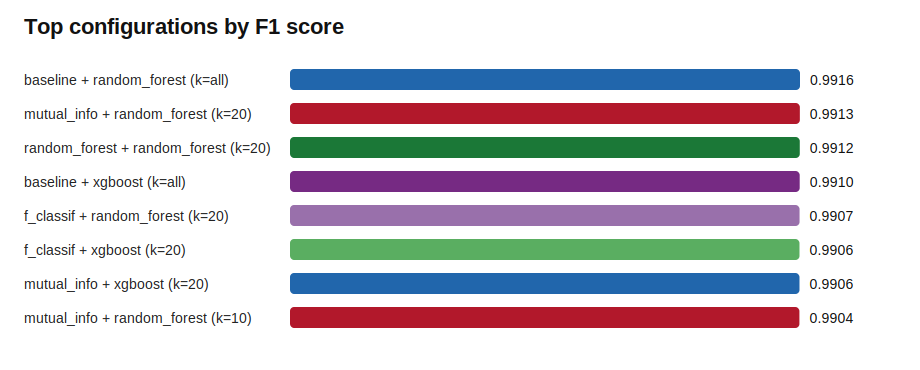

# Feature Selection Benchmark Report: Ransomware.csv

Highest F1: **baseline + random_forest (k=all)** with F1=0.9916. 

## Dataset And Run

- Rows evaluated: **5,000**
- Usable numeric features: **54**
- Benign samples: **1,497**
- Ransomware samples: **3,503**
- Cross-validation folds: **3**
- Selectors: **baseline, mutual_info, f_classif, l1, random_forest**
- Classifiers: **logistic, random_forest, svm, knn, xgboost**
- k values tested: **10, 20**

## Leaderboard

| Configuration | F1 | Recall | Precision | PR-AUC | Features | Fit seconds |
| --- | --- | --- | --- | --- | --- | --- |
| baseline + random_forest (k=all) | 0.9916 | 99.17% | 99.14% | 0.9993 | 54.0 | 0.55 |
| mutual_info + random_forest (k=20) | 0.9913 | 99.09% | 99.17% | 0.9993 | 20.0 | 1.03 |
| random_forest + random_forest (k=20) | 0.9912 | 99.17% | 99.06% | 0.9992 | 20.0 | 1.69 |
| baseline + xgboost (k=all) | 0.9910 | 99.09% | 99.11% | 0.9995 | 54.0 | 0.31 |
| f_classif + random_forest (k=20) | 0.9907 | 99.06% | 99.09% | 0.9993 | 20.0 | 0.85 |
| f_classif + xgboost (k=20) | 0.9906 | 99.12% | 99.00% | 0.9995 | 20.0 | 0.22 |
| mutual_info + xgboost (k=20) | 0.9906 | 99.06% | 99.06% | 0.9995 | 20.0 | 0.72 |
| mutual_info + random_forest (k=10) | 0.9904 | 99.06% | 99.03% | 0.9992 | 10.0 | 0.98 |
| l1 + random_forest (k=20) | 0.9902 | 99.12% | 98.92% | 0.9992 | 20.0 | 0.75 |
| mutual_info + xgboost (k=10) | 0.9901 | 98.92% | 99.11% | 0.9993 | 10.0 | 0.69 |

## Best Vs. No Feature Selection

- Best configuration: **baseline + random_forest (k=all)**
- Best baseline: **baseline + random_forest (k=all)**
- F1 change vs baseline: **+0.0000**
- Feature reduction vs baseline: **0.0%**

## Most Stable Features In The Best Configuration

| Feature | Selected in |
| --- | --- |
| AddressOfEntryPoint | 3/3 folds |
| BaseOfCode | 3/3 folds |
| BaseOfData | 3/3 folds |
| Characteristics | 3/3 folds |
| CheckSum | 3/3 folds |
| DllCharacteristics | 3/3 folds |
| ExportNb | 3/3 folds |
| FileAlignment | 3/3 folds |
| ImageBase | 3/3 folds |
| ImportsNb | 3/3 folds |
| ImportsNbDLL | 3/3 folds |
| ImportsNbOrdinal | 3/3 folds |
