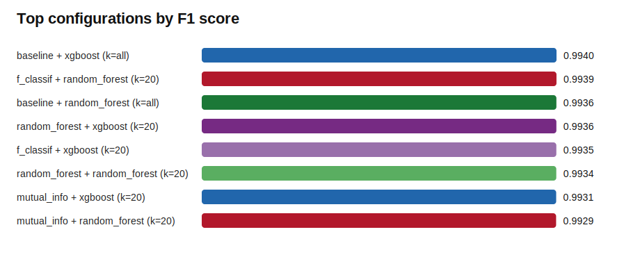
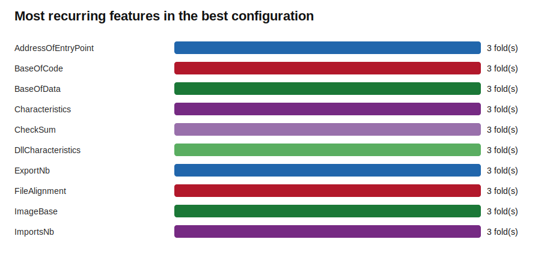

# Feature Selection Benchmark Report: Ransomware.csv

Highest F1: **baseline + xgboost (k=all)** with F1=0.9940. 

## Dataset And Run

- Rows evaluated: **20,000**
- Usable numeric features: **54**
- Benign samples: **5,987**
- Ransomware samples: **14,013**
- Cross-validation folds: **3**
- Selectors: **baseline, mutual_info, random_forest, f_classif**
- Classifiers: **random_forest, xgboost**
- k values tested: **20**

## Leaderboard

| Configuration | F1 | Recall | Precision | PR-AUC | Features | Fit seconds |
| --- | --- | --- | --- | --- | --- | --- |
| baseline + xgboost (k=all) | 0.9940 | 99.37% | 99.43% | 0.9998 | 54.0 | 0.75 |
| f_classif + random_forest (k=20) | 0.9939 | 99.40% | 99.38% | 0.9996 | 20.0 | 1.30 |
| baseline + random_forest (k=all) | 0.9936 | 99.36% | 99.36% | 0.9996 | 54.0 | 1.41 |
| random_forest + xgboost (k=20) | 0.9936 | 99.39% | 99.34% | 0.9997 | 20.0 | 1.88 |
| f_classif + xgboost (k=20) | 0.9935 | 99.34% | 99.36% | 0.9996 | 20.0 | 0.68 |
| random_forest + random_forest (k=20) | 0.9934 | 99.36% | 99.32% | 0.9995 | 20.0 | 2.19 |
| mutual_info + xgboost (k=20) | 0.9931 | 99.26% | 99.35% | 0.9996 | 20.0 | 2.07 |
| mutual_info + random_forest (k=20) | 0.9929 | 99.28% | 99.29% | 0.9996 | 20.0 | 15.64 |

## Best Vs. No Feature Selection

- Best configuration: **baseline + xgboost (k=all)**
- Best baseline: **baseline + xgboost (k=all)**
- F1 change vs baseline: **+0.0000**
- Feature reduction vs baseline: **0.0%**

## Most Stable Features In The Best Configuration

| Feature | Selected in |
| --- | --- |
| AddressOfEntryPoint | 3/3 folds |
| BaseOfCode | 3/3 folds |
| BaseOfData | 3/3 folds |
| Characteristics | 3/3 folds |
| CheckSum | 3/3 folds |
| DllCharacteristics | 3/3 folds |
| ExportNb | 3/3 folds |
| FileAlignment | 3/3 folds |
| ImageBase | 3/3 folds |
| ImportsNb | 3/3 folds |
| ImportsNbDLL | 3/3 folds |
| ImportsNbOrdinal | 3/3 folds |
